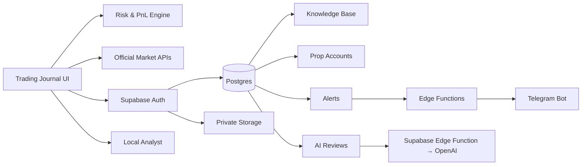

<div align="center">

# 📈 AI Trading Journal

### A privacy-first trading operating system for journaling, risk control, market review and continuous improvement.

Track trades. Calculate risk. Review decisions. Sync your knowledge. Keep the process measurable.

<br>

[](https://tetiana-a.github.io/ai-trading-journal/)
[](https://tetiana-a.github.io/ai-trading-journal/system.html)
[](https://tetiana-a.github.io/ai-trading-journal/learning.html)
[](LICENSE)

<br><br>


<br>

**Built as a real working tool, not a mockup.**  
Vanilla JavaScript on the frontend, Supabase for cloud data, official public market feeds from Binance / Bybit / OKX / Kraken, optional AI analysis, prop-risk controls, broker-history import and Telegram-ready automation.

</div>

---

## 🎯 Why I built it

Most trading journals stop at one of two extremes:

- a spreadsheet that becomes painful to maintain;
- an oversized SaaS platform with features you never use.

**AI Trading Journal** is designed around a simpler idea:

> **Context → Plan → Risk → Execute → Journal → Review → Improve**

The system keeps the workflow visible and measurable instead of turning trading into a collection of disconnected screenshots, notes and emotions.

---

## ✨ Core features

| Feature | What it does |
|---|---|
| 🧮 **Automatic PnL** | Calculates long/short PnL, return %, averages and performance metrics |
| 🟢 **Open & closed trades** | Open a trade first, close it later with exit price, emotion and exit reason |
| 📸 **Trade screenshots** | Paste with Ctrl+V or upload images and attach them to each trade |
| 💹 **Live market prices** | Pull candle data from Binance, Bybit, OKX and Kraken public APIs |
| 📊 **Statistics dashboard** | Win rate, profit factor, average win/loss, best trade and trading activity |
| 📈 **Equity curve** | Visualizes account performance from closed trades |
| 📅 **Calendar & monthly review** | See trading days, monthly PnL and monthly win rate |
| 🤖 **AI-assisted review** | Server-side trade/history/weekly reviews with private photos, metrics and a saved report archive |
| 🧠 **Knowledge Base** | Save trading rules, strategy notes, prop-firm rules and study materials in Supabase |
| ☁️ **Cloud sync** | Authenticated direct Supabase storage for trades and private screenshots |
| 🛡️ **Prop Risk Guard** | Tracks personal daily stop, firm daily loss, max loss and target distance |
| 🚦 **STOP DAY protection** | Blocks new journal entries after the configured stop condition / loss streak |
| 🔔 **Price & risk alerts** | Store price alerts and risk thresholds for backend monitoring |
| 📱 **Telegram integration** | Backend command architecture for status, risk, daily PnL, reviews and weekly reports |
| 🌐 **RU / EN system pages** | Trading System, Learning Hub and Prop Firms guides available in Russian and English |
| 🎧 **Multi-station radio** | Built-in player with Web Audio / canvas-reactive visual effects |
| 🌗 **Light / dark theme** | Persistent interface theme |
| 📤 **Import / export** | JSON backup / restore and CSV export |

---

## 🧠 Trading System Hub

The project has grown beyond a journal into a small personal trading workstation.

👉 **[Open Trading System Hub](https://tetiana-a.github.io/ai-trading-journal/system.html)**

It includes:

- 📉 **TradingView Lightweight Charts™** rendering with Binance, Bybit, OKX and Kraken public candle data;
- 🧮 **position-size & R:R calculator**;
- 🛡️ **prop-account dashboard** with FTMO, The5ers, iTrade and custom presets;
- ☁️ **Supabase login and cloud sync**;
- 🧠 **personal Knowledge Base**;
- 🔔 **price alerts**;
- 🤖 **free local trade-review logic**;
- 📱 **Telegram automation layer**;
- 🔌 **universal Broker CSV importer** for common MT5/cTrader/exchange statement formats;
- 📊 **strategy / timeframe / session analytics** with expectancy and win rate;
- 🎧 **professional Audio Deck** with curated Czech, US, French and Swiss stations + audio-reactive / generative UI animation.

### System architecture



---

## 🧩 Personalized Prop-Trading OS

This project is intentionally built as a **personal trading operating system**, not a generic signal bot.

The target architecture is:

> **Official Market Data → Risk Plan → Trade Execution → Broker History → Journal → Supabase → Strategy Analytics → Knowledge Base → AI Review → Alerts → Telegram**

The system is designed to adapt to **my own prop-firm accounts, strategies, learning materials, rules and review process**.

### What is personalized

- 🧠 **My Knowledge Base** — strategy rules, study notes, prop-firm rules, psychology and post-trade conclusions;
- 🛡️ **My Prop Rules** — FTMO / The5ers / iTrade / custom daily-loss and max-loss limits;
- 📊 **My Strategy Analytics** — performance grouped by strategy, setup, timeframe and session;
- 📱 **My Telegram Bot** — status, risk, open trades, daily PnL, review and weekly-report commands;
- ☁️ **My Supabase** — private authenticated storage for trades, screenshots, knowledge, reviews, alerts and account metadata;
- 🔌 **My Broker / Platform layer** — read-only-first integrations and history imports;
- 🤖 **My AI review layer** — server-side OpenAI review of trades, history and weeks; separate local rules tool in System Hub;
- 🧰 **My codebase** — every rule, workflow and UI component can be changed as the trading process evolves.

### Official / read-only-first integrations

| Platform | Integration | Current status |
|---|---|---|
| **Binance** | Official public candles / prices | ✅ Live |
| **Bybit** | Official V5 public market API | ✅ Live |
| **OKX** | Official V5 public market API | ✅ Live |
| **Kraken** | Official public OHLC API | ✅ Live |
| **MetaTrader 5** | Universal broker CSV history import | ✅ Working |
| **cTrader** | Official OAuth, `accounts` read-only scope | 🟡 Backend flow prepared; app credentials required |
| **FTMO** | Import through MT5 / cTrader / platform used by the account | ✅ Supported via history import |
| **The5ers** | Import through the underlying trading platform | ✅ Supported via history import |
| **iTrade** | Import through the underlying trading platform | ✅ Supported via history import |
| **FundedNext** | Import through the underlying trading platform | ✅ Supported via history import |

> Analytics integrations should use **public data, OAuth, read-only keys or statement import**.  
> The journal does not need trading or withdrawal permissions.

### Daily operating workflow

```text
1. Check prop-account limits
2. Define setup + invalidation + risk
3. Calculate position size and planned R:R
4. Execute the trade in the broker / prop platform
5. Log or import the trade
6. Attach screenshot + strategy + setup + timeframe + session
7. Close the trade and preserve broker-reported PNL / fees
8. Run local or AI review
9. Compare strategy expectancy and rule compliance
10. Receive only useful alerts / Telegram summaries
```

The goal is not to make AI “guess the market”.

The goal is to build a system that **knows the rules, measures execution quality, catches repeated mistakes and makes risk visible before the next trade**.

---

## 🛡️ Prop Trading tools

A dedicated prop-firm section is included:

👉 **[Prop Firms Guide](https://tetiana-a.github.io/ai-trading-journal/prop-firms.html)**

Current tooling covers:

- FTMO
- The5ers
- iTrade
- FundedNext reference workflow
- daily loss / max loss / profit target tracking
- personal risk budget vs. firm hard limits
- H4 → H1 → M15 → M5 workflow
- challenge risk discipline
- Czech OSVČ / payout record-keeping guidance

The software treats a prop firm's hard drawdown as an **emergency boundary**, not as a recommended working risk budget.

---

## 📚 Trading Learning Hub

👉 **[Open Learning Hub](https://tetiana-a.github.io/ai-trading-journal/learning.html)**  
👉 **[Browse source notes](learning/README.md)**

The learning section contains original study notes and practical summaries on:

- market structure and trend;
- support / resistance;
- candlestick patterns;
- RSI, MACD and divergence;
- risk management and position sizing;
- fundamental / news analysis;
- Smart Money concepts;
- liquidity, POI, order blocks and imbalance;
- BOS / CHOCH;
- supply / demand;
- Fibonacci;
- Wyckoff;
- trading psychology;
- trade review and journaling.

> Third-party paid course files and full copyrighted books are **not** redistributed in this repository.

---

## 🛠️ Tech stack

### Frontend

<p>
  
  
  
  
  
</p>

### Data & backend

<p>
  
  
  
  
  
  
  
  
</p>

### AI & automation

<p>
  
  
  
  
</p>

The app intentionally keeps the frontend lightweight: **no frontend framework and no build step are required for the core journal**.

---

## 🔐 Privacy & security

The project uses a **local-first + optional-cloud** model.

### Local mode

Without Supabase login:

- trades stay in the browser;
- screenshots stay local;
- settings persist locally;
- no account is required.

### Cloud mode

When you explicitly sign in:

- trades can sync to Supabase Postgres;
- screenshots can sync to a **private** Storage bucket;
- Row Level Security is enabled on the trading tables;
- records are scoped to the authenticated user.

### Secrets

Sensitive credentials are **not committed to GitHub**.

- Supabase publishable key → browser-safe public client configuration;
- Telegram token → backend secret;
- AI provider secret keys → backend / local secure configuration;
- service-role credentials → server-side only.

---

## 🤖 AI review

The project supports two levels of analysis:

### 1. Free local review

No API key required.

The local analyst checks:

- missing entry / exit reasoning;
- emotional-risk markers;
- relative PnL size;
- process consistency;
- journaling completeness.

### 2. Optional LLM review

For deeper natural-language analysis, an external provider can be connected.

The journal calls the authenticated `journal-review` Edge Function, which uses OpenAI with vision. Provider keys are configured in Supabase Secrets, never in browser settings.

> AI review is a **decision-review tool**, not a trading-signal service.

---

## 📱 Telegram automation

The repository includes backend infrastructure for a private Telegram trading assistant.

Planned / supported commands include:

```text
/status   → prop account & drawdown
/today    → today's trades & PnL
/risk     → remaining personal / firm risk
/open     → open trades
/review   → latest trade review
/weekly   → 7-day report
/help     → command list
```

Telegram setup requires private Edge Function secrets and an allowed chat ID.

---

## 🎧 Professional Audio Deck

The workspace includes a compact floating **Audio Deck** designed for long trading / review sessions without turning the navigation into a media-player UI.

Current curated stations include:

- 🇨🇿 **Radio Kiss** — pop / dance;
- 🇨🇿 **Radio 1 CZ** — alternative / electronic;
- 🇺🇸 **SomaFM Groove Salad** — chill / downtempo;
- 🇺🇸 **SomaFM Drone Zone** — ambient / focus;
- 🇺🇸 **SomaFM Secret Agent** — cinematic / lounge;
- 🇫🇷 **FIP** — eclectic / jazz / world;
- 🇺🇸 **KEXP** — indie / alternative;
- 🇨🇭 **Radio Swiss Jazz** — jazz / soul / blues.

The deck includes:

- previous / play-pause / next controls;
- station selector with country + genre metadata;
- persistent volume and selected station;
- responsive floating dock;
- playback / buffering / error state;
- optional visualizer toggle;
- Web Audio spectrum analysis when the stream exposes CORS audio data;
- a generative fallback when playback works but browser audio analysis is unavailable;
- `prefers-reduced-motion` support.

The background animation combines a subtle technical grid, orbital rings, waveform horizon, particles and market-tape bars. It stays intentionally low-contrast so the trading data remains the primary visual layer.

---

## 🚀 Quick start

### Option A — Live version

**[Open AI Trading Journal →](https://tetiana-a.github.io/ai-trading-journal/)**

### Option B — Local

```bash
git clone https://github.com/tetiana-a/ai-trading-journal.git
cd ai-trading-journal
```

Then open `index.html` in your browser.

No npm install is required for the core frontend.

---

## 🗂️ Project structure

```text
ai-trading-journal/
├── index.html                 # main journal
├── system.html                # RU Trading System Hub
├── system-en.html             # EN Trading System Hub
├── learning.html              # RU Learning Hub
├── learning-en.html           # EN Learning Hub
├── prop-firms.html            # RU Prop Firms guide
├── prop-firms-en.html         # EN Prop Firms guide
├── learning/                  # original study notes
├── src/
│   ├── css/
│   └── js/
│       ├── trades.js
│       ├── market-api.js
│       ├── market-terminal.js
│       ├── cloud-sync.js
│       ├── cloud-tools.js
│       ├── import-tools.js
│       ├── trade-tools.js
│       ├── ai-service.js
│       └── radio-visualizer.js
├── integrations/               # official read-only connection matrix
├── supabase/
│   └── migrations/
└── preview.png.png
```

---

## 🗺️ Roadmap

- [x] Trade journal & PnL engine
- [x] Statistics / equity / monthly review
- [x] Screenshot library
- [x] Binance live prices
- [x] TradingView-style live chart
- [x] Supabase schema & Auth integration
- [x] Private screenshot storage
- [x] Knowledge Base
- [x] Prop-account risk dashboard
- [x] Local risk analyst
- [x] RU / EN system pages
- [x] Telegram backend architecture
- [ ] Finish production Telegram activation flow
- [x] Multi-exchange public market adapter: Binance / Bybit / OKX / Kraken
- [x] Universal broker CSV importer with broker-reported PNL support
- [x] Strategy / setup / timeframe / session metadata
- [x] Strategy expectancy analytics
- [x] cTrader read-only OAuth backend scaffold
- [ ] Register cTrader Open API app and enable production OAuth connection
- [ ] Add automatic MT5 read-only history sync bridge
- [x] Add richer strategy tags & setup analytics
- [x] Add public exchange adapters + broker CSV importer
- [x] Add basic expectancy by strategy / timeframe / session
- [ ] Add configurable AI provider routing
- [ ] Add automated weekly review dashboard

---

## ⚠️ Disclaimer

This repository is an educational and personal analytics tool.

It does **not** provide financial advice, guaranteed trading signals or guaranteed profitability. Trading and leveraged products involve risk.

---

## 🤝 Contributing

Issues and pull requests are welcome.

If you find a bug, security issue or a way to make the journal more useful without turning it into unnecessary complexity, feel free to open an issue.

---

## 📄 License

Released under the **MIT License**.

---

<div align="center">

### 👩‍💻 Built by [Tetiana Kotolup](https://tetianakotolup.com/)

**AI Automation Developer · Full-Stack Builder · Trading Systems Enthusiast**

[Portfolio](https://tetianakotolup.com/) · [GitHub](https://github.com/tetiana-a) · [Live Project](https://tetiana-a.github.io/ai-trading-journal/)

<br>

⭐ **If this project is useful, consider giving it a star.**

</div>


### Workspace and playback hardening

The shared workspace layer keeps the existing rose/graphite palette, adds direct links to market, position sizing, risk and journal, and improves form and table readability. The existing Audio Deck, station skipping, visualizer toggle and canvas are preserved. Sonic Universe, Lush and Beat Blender expand the selection to 21 stations. Official listings: [SomaFM](https://somafm.com/listen/) and [Radio France](https://developers.radiofrance.fr/doc/tutorial-by-example/list-locals-and-webradios).

Connection attempts time out after 12 seconds per candidate, CORS failures retry direct playback with generative canvas, and switching or pausing cancels stale requests. A stream error stops playback and shows an inline message. Stored volume is clamped; local storage failure does not stop radio controls. Reduced motion and background tabs pause canvas rendering while audio continues. Supabase, charts, Telegram, broker import and prop guard modules are unchanged.


### Trade form autofill and expanded radio (2026-10-07)

The Audio Deck now includes 21 stations. New channels: Indie Pop Rocks!, Underground 80s, Folk Forward, Left Coast 70s, Space Station Soma, Deep Space One, DEF CON Radio, cliqhop idm, Bossa Beyond and PopTron. Their primary and backup HTTPS URLs come from the [official SomaFM channel catalogue](https://somafm.com/channels.json); all 20 new endpoints returned CORS-enabled audio and decoded to non-silent samples during verification. Availability is a point-in-time check, not a future uptime guarantee. The radio canvas is unchanged.

Quick fill above the trade form offers history suggestions for text and numeric inputs, a note picker, and explicit full-field copying from a selected trade. Date, direction, status, broker/account, setup, risk fields, prices, quantity, fees, reasons and notes are included; screenshots are not copied. Review the copied values before submitting. Adding still uses the existing validation and prop guard.

All 24 trade fields are saved as a local draft and restored on reload. Broker, account, strategy, setup, timeframe and session carry forward after adding a trade; prices and quantities are not silently reused for a new trade. Close-trade fields share exit-price and exit-reason suggestions. Use Clear fields to replace the current draft with a blank form. Drafts and context stay in browser storage and are not synced to Supabase. Browser storage failure is shown inline.


### Direct Supabase journal storage

New trades, close actions, JSON/CSV imports and screenshot uploads now require an authenticated Supabase session. The journal commits to Supabase before changing the displayed history or clearing the form. Failed uploads or database writes remain visible as errors; the form stays available for retry. Screenshot uploads retain the private `trade-screenshots` bucket and its 5 MiB limit after compression.

Use **Войти по email** in the journal, then open the email link in the same browser. **Перенести старые сделки из браузера** explicitly copies legacy local records into the signed-in account and skips IDs already in Supabase. The old browser backup is retained. New trade records and photos are no longer written to localStorage; unfinished text drafts and UI preferences remain local. Loading history reads Supabase with pagination instead of merging stale browser records. The System Hub review also reads cloud trades.

Verification uses mocked authenticated storage/database responses for success, upload failure, database failure, unavailable login and local quota exhaustion; production RLS and bucket settings are checked read-only. A real personal login is required to verify end-to-end saving as the user.


### Evidence-based AI review center

The journal provides **Разобрать сделку**, **Анализ всей истории**, and **Недельный отчёт**, plus a private report archive and JSON download. Reports are generated on demand, not automatically scheduled. The weekly report covers the last seven calendar days including today in Europe/Prague, using close timestamps for closed trades and opening timestamps for open trades, with trade_date as a fallback.

Setup: deploy `supabase/functions/journal-review/index.ts` with `verify_jwt = true`; add `OPENAI_API_KEY` to project Secrets. Optional `JOURNAL_REVIEW_MODEL` defaults to `gpt-4.1-mini` and must support image input and JSON chat completions. ChatGPT subscriptions do not include API billing. The settings button checks server key presence; a successful generated report verifies provider access. No credentials are sent to the browser. Existing browser-stored legacy API keys are no longer read or used by the reviewer.

The function validates the user with Supabase Auth, reads trades/knowledge/prop accounts with the caller's JWT and RLS, calculates statistics, retrieves owned private images, requests a structured review and inserts it into `ai_reviews`. It never uses a service-role key. A successful UI state requires the saved row. Model-generated text is rendered as plain text, and unknown trade citations are rejected. Reports store metrics, scope, coverage, image references, usage and a SHA-256 source fingerprint. Cached retries use a request ID; simultaneous requests are blocked within an Edge isolate, with a best-effort 20 successful reports/hour/user limit. This is not a globally atomic billing cap.

Coverage: all selected trades are included in calculations (up to 20,000; larger requests fail explicitly). Natural-language review uses up to 80 recent trade records, 1,200 characters per note field, six photos (12 MiB total), and the 12 latest knowledge documents (2,000 characters each). The report exposes these limits and missing images; it never claims to have reviewed omitted content. All trades are paginated. Large prompts fail explicitly instead of silently dropping metrics.

PNL uses broker-provided net results when available. USDT/USDC price-based results are labelled estimates assuming base-asset units. Missing lot contract/conversion information produces unknown PNL rather than invented values. Broker net PNL is in unrecorded account currency and is separated from quote-currency estimates; unrelated accounts are not totalled. Drawdown is based on known closed results only and cannot establish intraday FTMO equity compliance. No live equity feed, guaranteed profitability, order execution, or automated signals are provided.

`npm test` runs existing journal tests, review UI tests and mocked server pipeline tests. These cover auth isolation, uploads, pagination, Prague date boundaries, PNL semantics, provider failures, save failures, retries and safe rendering. Live personal-account/model billing validation requires the user's configured server key and signed-in browser.

### Learning hub languages

Complete eight-module learning pages are available in Russian (`learning.html`), English (`learning-en.html`), Ukrainian (`learning-uk.html`) and Czech (`learning-cs.html`). The language selector preserves the current section. All four pages share compact responsive headings, theme controls and the international radio dock with play/pause, volume and localized controls. Playback starts with the dock’s play button; existing stream fallback and canvas animation are preserved.

### Performance dashboard

The journal home screen includes a responsive PNL/drawdown dashboard with 7/30/90-day and all-history filters, account and currency separation, six performance metrics, pointer/keyboard inspection and an accessible daily data table. It uses the currently loaded journal data and refreshes with journal changes. PNL and drawdown are aggregated at the end of each Prague calendar day using the close timestamp (trade date fallback). Open positions, unknown results and undated trades are disclosed separately. Broker net results are used without subtracting fees again; price-based crypto results are labeled estimates. Drawdown is for closed PNL only, not account equity or intraday prop compliance. Labels support RU/UK/EN/CS.

### MT5 Reporter (CSV preview)

`mt5-reporter.html` provides a download and installation guide for `downloads/mt5/TK_Journal_Reporter.mq5`. The read-only EA exports supported fully closed positions to UTF-8 CSV for the existing broker importer. It does not trade or send data over the network. Partial closures remain excluded until full closure; reversals and unsupported events are skipped. Broker-local timestamps and separate account charges require reconciliation. Compile and verify on a demo terminal before use: MetaEditor compilation and terminal execution have not been verified in this environment.

### Workspace design system

Shared semantic colors, spacing and component styles support a black/rose dark theme and warm-neutral/terracotta light theme. Theme choice persists across pages. Profit/loss use dedicated accessible colors; translucent surfaces keep text opaque. The journal puts the performance overview first and groups account controls in an expandable panel. The radio player and audio-reactive canvas retain their existing implementation.

### Trading plan and risk desk

Open System → Trading plan (`#strategyDesk`). Context, structure, bullish/bearish and no-trade scenarios accompany a live recalculating position estimate. Account snapshots and instrument specifications are manually supplied, not live broker balances. Linear crypto, Forex/CFDs, futures and shares use account-currency loss tick values; inverse contracts/options and spot shorts are blocked. Risk capacity is capped by daily/overall equity floors, additional open risk, portfolio cap, buffer, free margin, and volume/notional constraints; size rounds down. Costs and slippage are included. Floors must come from the exact account/program, including trailing rules; no universal prop preset is assumed.

Plans can be downloaded as JSON; this desk does not persist plans in Supabase or send orders. A completed checklist is not a profitable signal or broker-side risk enforcement. The EURUSD example is explicitly educational. Terminal specs and currency conversion must be verified before using estimates. Stop gaps may exceed the calculated loss. References: [Position Sizer](https://www.earnforex.com/metatrader-expert-advisors/Position-Sizer/), [MQL5 OrderCalcProfit](https://www.mql5.com/en/docs/trading/ordercalcprofit), [Freqtrade](https://www.freqtrade.io/en/stable/strategy-101/), [TradingView webhooks](https://www.tradingview.com/support/solutions/43000529348-how-to-configure-webhook-alerts/).

### Radio / YouTube deck

The existing audio dock now switches between radio and the requested YouTube video `cgQMjU_X6sc`. The official IFrame API loads only after selecting YouTube. Switching cancels pending radio connections and destroys the old video player; closing the dock leaves the background video playing. Video uses a bounded responsive floating player (up to 480px wide) with clickable native YouTube controls, including Skip ad when YouTube offers it. A persistent top-bar play/pause control and dock volume slider control the official player. The panel closes when video starts; reopening/closing it does not stop playback. Radio retains its original canvas animation; YouTube suspends that canvas and shows the floating video instead. Switching sources or leaving the page stops the previous source. API timeouts, autoplay blocking and embed restrictions offer a retry / YouTube link; availability of the third-party video is not guaranteed.
