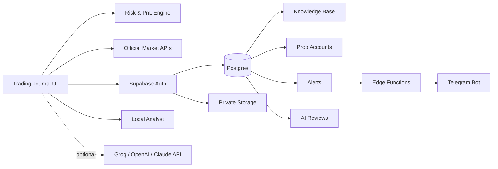

<div align="center">

# 📈 AI Trading Journal

### A privacy-first trading operating system for journaling, risk control, market review and continuous improvement.

Track trades. Calculate risk. Review decisions. Sync your knowledge. Keep the process measurable.

<br>

[](https://tetiana-a.github.io/ai-trading-journal/)
[](https://tetiana-a.github.io/ai-trading-journal/system.html)
[](https://tetiana-a.github.io/ai-trading-journal/learning.html)
[](LICENSE)

<br><br>


<br>

**Built as a real working tool, not a mockup.**  
Vanilla JavaScript on the frontend, Supabase for cloud data, official public market feeds from Binance / Bybit / OKX / Kraken, optional AI analysis, prop-risk controls, broker-history import and Telegram-ready automation.

</div>

---

## 🎯 Why I built it

Most trading journals stop at one of two extremes:

- a spreadsheet that becomes painful to maintain;
- an oversized SaaS platform with features you never use.

**AI Trading Journal** is designed around a simpler idea:

> **Context → Plan → Risk → Execute → Journal → Review → Improve**

The system keeps the workflow visible and measurable instead of turning trading into a collection of disconnected screenshots, notes and emotions.

---

## ✨ Core features

| Feature | What it does |
|---|---|
| 🧮 **Automatic PnL** | Calculates long/short PnL, return %, averages and performance metrics |
| 🟢 **Open & closed trades** | Open a trade first, close it later with exit price, emotion and exit reason |
| 📸 **Trade screenshots** | Paste with Ctrl+V or upload images and attach them to each trade |
| 💹 **Live market prices** | Pull candle data from Binance, Bybit, OKX and Kraken public APIs |
| 📊 **Statistics dashboard** | Win rate, profit factor, average win/loss, best trade and trading activity |
| 📈 **Equity curve** | Visualizes account performance from closed trades |
| 📅 **Calendar & monthly review** | See trading days, monthly PnL and monthly win rate |
| 🤖 **AI-assisted review** | Optional LLM review plus a free local rule-based process analyst |
| 🧠 **Knowledge Base** | Save trading rules, strategy notes, prop-firm rules and study materials in Supabase |
| ☁️ **Cloud sync** | Optional Supabase Auth + Postgres sync for trades and private screenshots |
| 🛡️ **Prop Risk Guard** | Tracks personal daily stop, firm daily loss, max loss and target distance |
| 🚦 **STOP DAY protection** | Blocks new journal entries after the configured stop condition / loss streak |
| 🔔 **Price & risk alerts** | Store price alerts and risk thresholds for backend monitoring |
| 📱 **Telegram integration** | Backend command architecture for status, risk, daily PnL, reviews and weekly reports |
| 🌐 **RU / EN system pages** | Trading System, Learning Hub and Prop Firms guides available in Russian and English |
| 🎧 **Multi-station radio** | Built-in player with Web Audio / canvas-reactive visual effects |
| 🌗 **Light / dark theme** | Persistent interface theme |
| 📤 **Import / export** | JSON backup / restore and CSV export |

---

## 🧠 Trading System Hub

The project has grown beyond a journal into a small personal trading workstation.

👉 **[Open Trading System Hub](https://tetiana-a.github.io/ai-trading-journal/system.html)**

It includes:

- 📉 **TradingView Lightweight Charts™** rendering with Binance, Bybit, OKX and Kraken public candle data;
- 🧮 **position-size & R:R calculator**;
- 🛡️ **prop-account dashboard** with FTMO, The5ers, iTrade and custom presets;
- ☁️ **Supabase login and cloud sync**;
- 🧠 **personal Knowledge Base**;
- 🔔 **price alerts**;
- 🤖 **free local trade-review logic**;
- 📱 **Telegram automation layer**;
- 🔌 **universal Broker CSV importer** for common MT5/cTrader/exchange statement formats;
- 📊 **strategy / timeframe / session analytics** with expectancy and win rate;
- 🎧 **radio player + audio-reactive UI animation**.

### System architecture



---

## 🧩 Personalized Prop-Trading OS

This project is intentionally built as a **personal trading operating system**, not a generic signal bot.

The target architecture is:

> **Official Market Data → Risk Plan → Trade Execution → Broker History → Journal → Supabase → Strategy Analytics → Knowledge Base → AI Review → Alerts → Telegram**

The system is designed to adapt to **my own prop-firm accounts, strategies, learning materials, rules and review process**.

### What is personalized

- 🧠 **My Knowledge Base** — strategy rules, study notes, prop-firm rules, psychology and post-trade conclusions;
- 🛡️ **My Prop Rules** — FTMO / The5ers / iTrade / custom daily-loss and max-loss limits;
- 📊 **My Strategy Analytics** — performance grouped by strategy, setup, timeframe and session;
- 📱 **My Telegram Bot** — status, risk, open trades, daily PnL, review and weekly-report commands;
- ☁️ **My Supabase** — private authenticated storage for trades, screenshots, knowledge, reviews, alerts and account metadata;
- 🔌 **My Broker / Platform layer** — read-only-first integrations and history imports;
- 🤖 **My AI review layer** — local rule-based review now, external LLM providers optional later;
- 🧰 **My codebase** — every rule, workflow and UI component can be changed as the trading process evolves.

### Official / read-only-first integrations

| Platform | Integration | Current status |
|---|---|---|
| **Binance** | Official public candles / prices | ✅ Live |
| **Bybit** | Official V5 public market API | ✅ Live |
| **OKX** | Official V5 public market API | ✅ Live |
| **Kraken** | Official public OHLC API | ✅ Live |
| **MetaTrader 5** | Universal broker CSV history import | ✅ Working |
| **cTrader** | Official OAuth, `accounts` read-only scope | 🟡 Backend flow prepared; app credentials required |
| **FTMO** | Import through MT5 / cTrader / platform used by the account | ✅ Supported via history import |
| **The5ers** | Import through the underlying trading platform | ✅ Supported via history import |
| **iTrade** | Import through the underlying trading platform | ✅ Supported via history import |
| **FundedNext** | Import through the underlying trading platform | ✅ Supported via history import |

> Analytics integrations should use **public data, OAuth, read-only keys or statement import**.  
> The journal does not need trading or withdrawal permissions.

### Daily operating workflow

```text
1. Check prop-account limits
2. Define setup + invalidation + risk
3. Calculate position size and planned R:R
4. Execute the trade in the broker / prop platform
5. Log or import the trade
6. Attach screenshot + strategy + setup + timeframe + session
7. Close the trade and preserve broker-reported PNL / fees
8. Run local or AI review
9. Compare strategy expectancy and rule compliance
10. Receive only useful alerts / Telegram summaries
```

The goal is not to make AI “guess the market”.

The goal is to build a system that **knows the rules, measures execution quality, catches repeated mistakes and makes risk visible before the next trade**.

---

## 🛡️ Prop Trading tools

A dedicated prop-firm section is included:

👉 **[Prop Firms Guide](https://tetiana-a.github.io/ai-trading-journal/prop-firms.html)**

Current tooling covers:

- FTMO
- The5ers
- iTrade
- FundedNext reference workflow
- daily loss / max loss / profit target tracking
- personal risk budget vs. firm hard limits
- H4 → H1 → M15 → M5 workflow
- challenge risk discipline
- Czech OSVČ / payout record-keeping guidance

The software treats a prop firm's hard drawdown as an **emergency boundary**, not as a recommended working risk budget.

---

## 📚 Trading Learning Hub

👉 **[Open Learning Hub](https://tetiana-a.github.io/ai-trading-journal/learning.html)**  
👉 **[Browse source notes](learning/README.md)**

The learning section contains original study notes and practical summaries on:

- market structure and trend;
- support / resistance;
- candlestick patterns;
- RSI, MACD and divergence;
- risk management and position sizing;
- fundamental / news analysis;
- Smart Money concepts;
- liquidity, POI, order blocks and imbalance;
- BOS / CHOCH;
- supply / demand;
- Fibonacci;
- Wyckoff;
- trading psychology;
- trade review and journaling.

> Third-party paid course files and full copyrighted books are **not** redistributed in this repository.

---

## 🛠️ Tech stack

### Frontend

<p>
  
  
  
  
  
</p>

### Data & backend

<p>
  
  
  
  
  
  
  
  
</p>

### AI & automation

<p>
  
  
  
  
</p>

The app intentionally keeps the frontend lightweight: **no frontend framework and no build step are required for the core journal**.

---

## 🔐 Privacy & security

The project uses a **local-first + optional-cloud** model.

### Local mode

Without Supabase login:

- trades stay in the browser;
- screenshots stay local;
- settings persist locally;
- no account is required.

### Cloud mode

When you explicitly sign in:

- trades can sync to Supabase Postgres;
- screenshots can sync to a **private** Storage bucket;
- Row Level Security is enabled on the trading tables;
- records are scoped to the authenticated user.

### Secrets

Sensitive credentials are **not committed to GitHub**.

- Supabase publishable key → browser-safe public client configuration;
- Telegram token → backend secret;
- AI provider secret keys → backend / local secure configuration;
- service-role credentials → server-side only.

---

## 🤖 AI review

The project supports two levels of analysis:

### 1. Free local review

No API key required.

The local analyst checks:

- missing entry / exit reasoning;
- emotional-risk markers;
- relative PnL size;
- process consistency;
- journaling completeness.

### 2. Optional LLM review

For deeper natural-language analysis, an external provider can be connected.

The architecture is compatible with Groq/OpenAI-compatible endpoints and can be extended to other providers.

> AI review is a **decision-review tool**, not a trading-signal service.

---

## 📱 Telegram automation

The repository includes backend infrastructure for a private Telegram trading assistant.

Planned / supported commands include:

```text
/status   → prop account & drawdown
/today    → today's trades & PnL
/risk     → remaining personal / firm risk
/open     → open trades
/review   → latest trade review
/weekly   → 7-day report
/help     → command list
```

Telegram setup requires private Edge Function secrets and an allowed chat ID.

---

## 🎧 Audio-reactive interface

One of the more experimental UX layers is the integrated radio player.

It combines:

- multiple internet radio stations;
- play / pause;
- volume control;
- Web Audio API analysis when available;
- Canvas-based animated rings, grid, waveform and particles;
- graceful visual fallback when a stream cannot expose frequency data through CORS.

The goal is not decoration for decoration's sake — it gives the project its own recognizable visual identity.

---

## 🚀 Quick start

### Option A — Live version

**[Open AI Trading Journal →](https://tetiana-a.github.io/ai-trading-journal/)**

### Option B — Local

```bash
git clone https://github.com/tetiana-a/ai-trading-journal.git
cd ai-trading-journal
```

Then open `index.html` in your browser.

No npm install is required for the core frontend.

---

## 🗂️ Project structure

```text
ai-trading-journal/
├── index.html                 # main journal
├── system.html                # RU Trading System Hub
├── system-en.html             # EN Trading System Hub
├── learning.html              # RU Learning Hub
├── learning-en.html           # EN Learning Hub
├── prop-firms.html            # RU Prop Firms guide
├── prop-firms-en.html         # EN Prop Firms guide
├── learning/                  # original study notes
├── src/
│   ├── css/
│   └── js/
│       ├── trades.js
│       ├── market-api.js
│       ├── market-terminal.js
│       ├── cloud-sync.js
│       ├── cloud-tools.js
│       ├── import-tools.js
│       ├── trade-tools.js
│       ├── ai-service.js
│       └── radio-visualizer.js
├── integrations/               # official read-only connection matrix
├── supabase/
│   └── migrations/
└── preview.png.png
```

---

## 🗺️ Roadmap

- [x] Trade journal & PnL engine
- [x] Statistics / equity / monthly review
- [x] Screenshot library
- [x] Binance live prices
- [x] TradingView-style live chart
- [x] Supabase schema & Auth integration
- [x] Private screenshot storage
- [x] Knowledge Base
- [x] Prop-account risk dashboard
- [x] Local risk analyst
- [x] RU / EN system pages
- [x] Telegram backend architecture
- [ ] Finish production Telegram activation flow
- [x] Multi-exchange public market adapter: Binance / Bybit / OKX / Kraken
- [x] Universal broker CSV importer with broker-reported PNL support
- [x] Strategy / setup / timeframe / session metadata
- [x] Strategy expectancy analytics
- [x] cTrader read-only OAuth backend scaffold
- [ ] Register cTrader Open API app and enable production OAuth connection
- [ ] Add automatic MT5 read-only history sync bridge
- [x] Add richer strategy tags & setup analytics
- [x] Add public exchange adapters + broker CSV importer
- [x] Add basic expectancy by strategy / timeframe / session
- [ ] Add configurable AI provider routing
- [ ] Add automated weekly review dashboard

---

## ⚠️ Disclaimer

This repository is an educational and personal analytics tool.

It does **not** provide financial advice, guaranteed trading signals or guaranteed profitability. Trading and leveraged products involve risk.

---

## 🤝 Contributing

Issues and pull requests are welcome.

If you find a bug, security issue or a way to make the journal more useful without turning it into unnecessary complexity, feel free to open an issue.

---

## 📄 License

Released under the **MIT License**.

---

<div align="center">

### 👩‍💻 Built by [Tetiana Kotolup](https://tetianakotolup.com/)

**AI Automation Developer · Full-Stack Builder · Trading Systems Enthusiast**

[Portfolio](https://tetianakotolup.com/) · [GitHub](https://github.com/tetiana-a) · [Live Project](https://tetiana-a.github.io/ai-trading-journal/)

<br>

⭐ **If this project is useful, consider giving it a star.**

</div>
