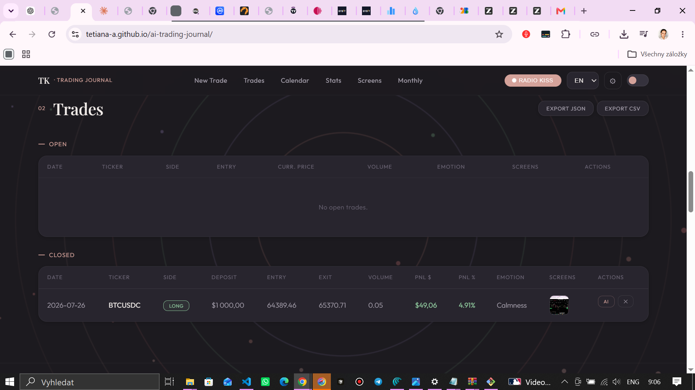

<div align="center">

# 📈 AI Trading Journal

**A trading journal that does the math for you.**
Log a trade, paste a screenshot, get an AI-powered post-mortem — everything else calculates itself.

[](https://tetiana-a.github.io/ai-trading-journal/)
<br>



<br>
[](#-tech-stack)
[](LICENSE)

[**→ Try it live**](https://tetiana-a.github.io/ai-trading-journal/)

</div>

---

## What it does

Most trading journals are either a spreadsheet you stop updating after week two, or a $30/month SaaS you don't need. This is neither — a single self-contained page that lives in your browser, remembers everything, and does the arithmetic so you can focus on the trade itself.

Open a position → log it in 20 seconds. Close it → PnL, win rate, profit factor and the equity curve update themselves.

## ✨ Features

| | |
|---|---|
| 🧮 **Auto-calculated PnL** | Long/short, $ and % of deposit — no manual formulas, ever |
| 🟢 **Open & closed trades** | Log the moment you open a position, close it later with exit price and reason |
| 💹 **Live market prices** | Pulls the current price from Binance right into the entry form |
| 📸 **Screenshots** | Paste from clipboard (Ctrl+V) or upload — attached per trade, with a searchable screenshot library |
| 🤖 **AI trade analysis** | One click sends the trade — entry/exit, emotion, notes — to an LLM for an objective, unemotional review |
| 📅 **Calendar view** | See trading days at a glance |
| 📊 **Statistics dashboard** | Win rate, profit factor, average win/loss, best trade |
| 📈 **Equity curve** | Drawn automatically from your closed trades |
| 🗓️ **Monthly breakdown** | PnL and win rate by month |
| 📤 **Import / export** | Back up or migrate your journal as JSON, export to CSV |
| 🌗 **Light / dark theme** | Toggle in one click |
| 🌍 **Multi-language** | RU · EN · UK · CS |
| 💾 **Autosave** | Every change is saved instantly — nothing to click |

## 🛠 Tech stack

Zero build step. Zero framework. Zero backend.

- **Vanilla HTML / CSS / JS** — one self-contained file
- **Canvas API** — equity curve + the audio-reactive background visualizer
- **Web Audio API** — live radio stream analysis for the background animation
- **Binance public API** — live prices
- **Groq API** (OpenAI-compatible) — AI trade analysis, bring your own free key
- **LocalStorage** — all data stays in your browser, nothing touches a server unless you ask it to

## 🚀 Quick start

No install, no dependencies:

```bash
git clone https://github.com/tetiana-a/ai-trading-journal.git
cd ai-trading-journal
open index.html   # or just double-click it
```

Or skip all that and use the [**live version**](https://tetiana-a.github.io/ai-trading-journal/) — same thing, already deployed.

### Optional: turn on AI analysis

1. Grab a free key at [console.groq.com/keys](https://console.groq.com/keys)
2. Click **⚙** in the top nav
3. Paste the key → Save

Your key is stored only in your own browser and is sent only to Groq's API, directly from your device, when you click **AI** on a trade.

## 🔒 Privacy

Everything — trades, screenshots, settings — lives in your browser's local storage. Nothing is sent anywhere except:

- live price lookups → Binance (public, read-only)
- if you turn it on → your trade data → Groq, for AI analysis

No accounts, no tracking, no server storing your trades.

## 🗺 Roadmap

- [ ] Optional cloud sync across devices
- [ ] More exchanges for live prices
- [ ] Custom tags & strategy tracking
- [ ] Streaks and habit tracking for journaling discipline

## 🤝 Contributing

Issues and pull requests are welcome — this is a personal tool that's meant to stay simple, so feature requests that add a build step or a backend will get a friendly no, but everything else is fair game.

## 📄 License

MIT — do whatever you want with it.

---

<div align="center">

Built by **[Tetiana Kotolup](https://tetiana-a.github.io/aiAutomationDev)** · AI Automation & Full-Stack Developer

</div>
