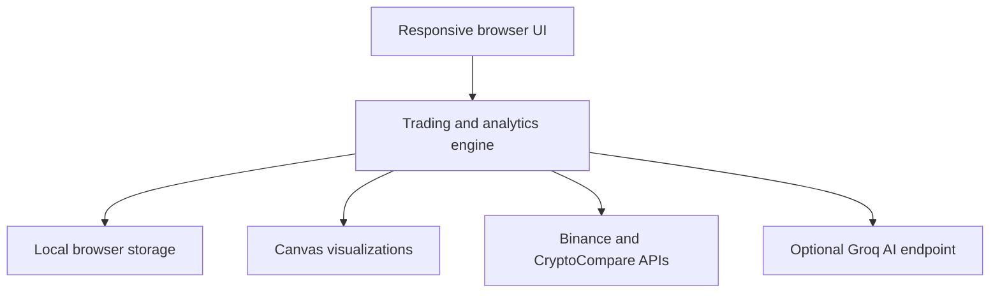

<div align="center">

# AI Trading Journal

### A privacy-first trading workspace for structured execution, live market context, and AI-assisted review

[](https://tetiana-a.github.io/ai-trading-journal/)
[](https://developer.mozilla.org/en-US/docs/Web/JavaScript)
[](LICENSE)

**[Live application](https://tetiana-a.github.io/ai-trading-journal/) · [Report an issue](https://github.com/tetiana-a/ai-trading-journal/issues)**

</div>

---

## Overview

AI Trading Journal is a responsive, browser-based application designed to turn individual trades into measurable performance data.

The application combines trade logging, automatic PNL calculation, live cryptocurrency prices, equity visualization, screenshot management, monthly reporting, and optional AI-assisted trade analysis in one focused interface.

It runs entirely in the browser and requires no build step or backend for its core functionality. Trading records remain on the user's device through local browser storage.

## Why This Project

Consistent trading performance depends on more than recording entries and exits. Traders also need a repeatable process for reviewing execution quality, identifying behavioral patterns, and measuring results over time.

This project was built to support that workflow:

* capture the complete context of every trade;
* calculate results consistently;
* compare planned and actual execution;
* retain chart evidence alongside trade records;
* review performance by trade and by month;
* enrich retrospective analysis with current market context and AI.

## Key Features

### Trade Management

* Create, edit, close, and delete trading positions
* Track ticker, date, direction, entry, exit, stop loss, take profit, size, and notes
* Support both `LONG` and `SHORT` workflows
* Store multiple chart screenshots with each trade
* Persist changes automatically in the browser

### Performance Analytics

* Automatic PNL calculation
* Win-rate and cumulative-performance metrics
* Equity curve rendered with the Canvas API
* Monthly aggregation of trades, wins, and PNL
* Clear visual distinction between profitable and losing positions

### Live Market Data

* Real-time cryptocurrency prices from the Binance public API
* Secondary price and news context from CryptoCompare
* Live valuation for open positions
* Market-aware context for AI-assisted reviews

### AI-Assisted Review

* Optional post-trade analysis powered by a configurable OpenAI-compatible endpoint
* Groq integration with a user-selected model
* Combined evaluation of trade parameters, price context, and recent market news
* Per-trade analysis available directly from the journal

### User Experience

* Responsive desktop and mobile layout
* Dark and light themes
* Animated market-inspired background
* Built-in Kiss FM audio stream with a generative fallback
* Screenshot preview library and full-screen image viewer
* Zero-install deployment through GitHub Pages

## Architecture



The application follows a lightweight client-side architecture:

| Layer         | Responsibility                                                               |
| ------------- | ---------------------------------------------------------------------------- |
| Presentation  | Responsive interface, themes, modals, forms, tables, and screenshot previews |
| Domain logic  | Trade lifecycle, PNL calculations, statistics, aggregation, and validation   |
| Persistence   | Browser-based storage for trades, settings, and attached screenshots         |
| Integrations  | Public price APIs, news data, AI analysis, and audio streaming               |
| Visualization | Equity curve and animated background rendered with the Canvas API            |

## Technology Stack

| Category         | Technology                                 |
| ---------------- | ------------------------------------------ |
| Core             | HTML5, CSS3, Vanilla JavaScript (ES6+)     |
| Data persistence | Web Storage API                            |
| Visualization    | HTML Canvas API                            |
| Market data      | Binance Public API, CryptoCompare API      |
| AI integration   | Groq API via an OpenAI-compatible endpoint |
| Typography       | Google Fonts — Poppins and JetBrains Mono  |
| Deployment       | GitHub Pages                               |

## Getting Started

### Run Locally

No package installation or build process is required.

```bash
git clone https://github.com/tetiana-a/ai-trading-journal.git
cd ai-trading-journal
```

Open `index.html` in a modern browser.

For more predictable browser API behavior, run a small local server:

```bash
python -m http.server 8000
```

Then open:

```text
http://localhost:8000
```

## AI Configuration

AI review is optional. The rest of the journal remains available without an API key.

1. Create a Groq API key at [console.groq.com/keys](https://console.groq.com/keys).
2. Open the application.
3. Select the settings icon in the navigation bar.
4. Enter the API URL, API key, and supported model name.
5. Save the configuration and start an analysis from a trade row.

Default configuration:

```text
API URL: https://api.groq.com/openai/v1/chat/completions
Model:   llama-3.3-70b-versatile
```

> Never commit an API key to this repository. The current static implementation stores user-provided settings in that browser's local storage. For a multi-user production deployment, secrets should be handled by a secure backend or serverless proxy.

## Data and Privacy

* Core trade data is stored locally in the user's browser.
* The project does not include a central database or authentication service.
* Clearing site data may permanently remove locally stored trades.
* AI analysis sends the relevant trade context to the configured AI provider.
* Live price and news requests are sent to the respective third-party APIs.

For important trading records, maintain an independent backup until export and synchronization capabilities are implemented.

## Engineering Decisions

* **Framework-free implementation:** minimizes dependencies and keeps deployment simple.
* **Local-first persistence:** allows immediate use without registration or backend infrastructure.
* **Progressive integration:** market data and AI improve the experience without blocking core journaling.
* **Responsive design:** maintains usability across desktop and smaller screens.
* **Separation by responsibility:** UI rendering, storage, calculations, market requests, and AI analysis are organized as distinct functional areas within the client application.

## Roadmap

* [ ] JSON and CSV import/export
* [ ] IndexedDB migration for larger screenshot collections
* [ ] Automated test coverage for PNL and aggregation logic
* [ ] Advanced filtering by asset, direction, setup, and date
* [ ] Risk-to-reward and expectancy analytics
* [ ] Authentication and optional cloud synchronization
* [ ] Secure server-side AI proxy
* [ ] Progressive Web App support
* [ ] Accessibility audit and keyboard navigation improvements

## Project Status

The project is an actively evolving portfolio application. The current version is suitable for personal browser-based journaling and demonstrates front-end architecture, third-party API integration, client-side persistence, data visualization, and AI-assisted workflow design.

It is not a brokerage platform and does not execute trades or provide financial advice.

## Contributing

Suggestions and improvements are welcome.

1. Fork the repository.

2. Create a feature branch:

   ```bash
   git checkout -b feature/your-feature
   ```

3. Commit your changes:

   ```bash
   git commit -m "feat: add your feature"
   ```

4. Push the branch:

   ```bash
   git push origin feature/your-feature
   ```

5. Open a pull request.

## License

Distributed under the [MIT License](LICENSE).

## Author

**Tetiana Kotolup**
AI Automation Developer · Full-Stack & Integrations

[](https://github.com/tetiana-a)
[](https://tetiana-a.github.io/aiAutomationDev/)

---

<div align="center">
Built with a focus on disciplined execution, measurable improvement, and clean user experience.
</div>
